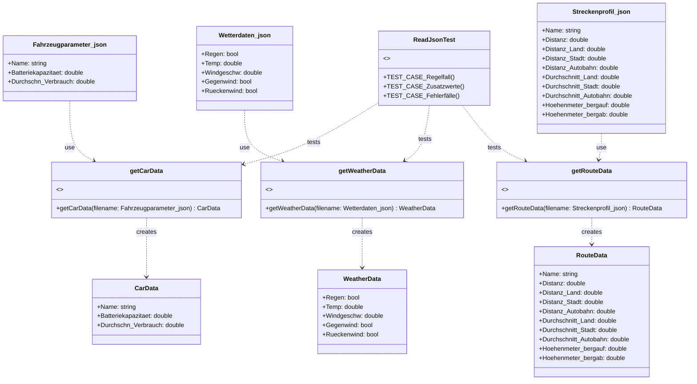
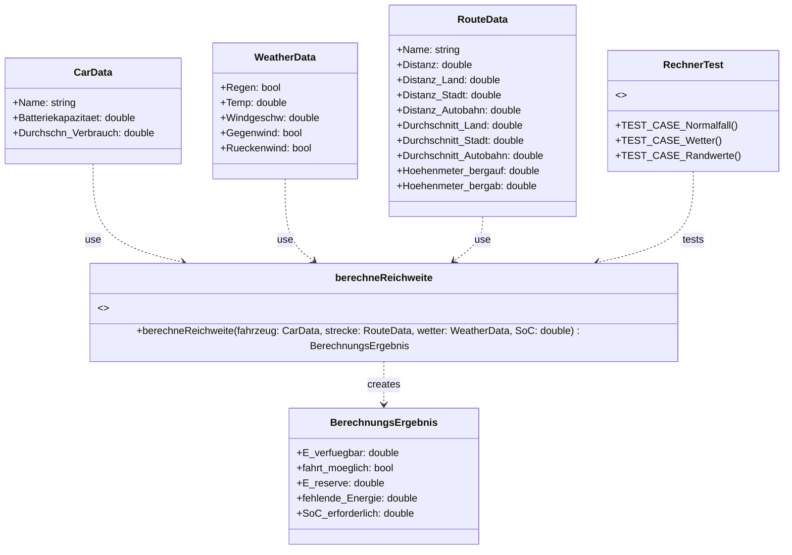
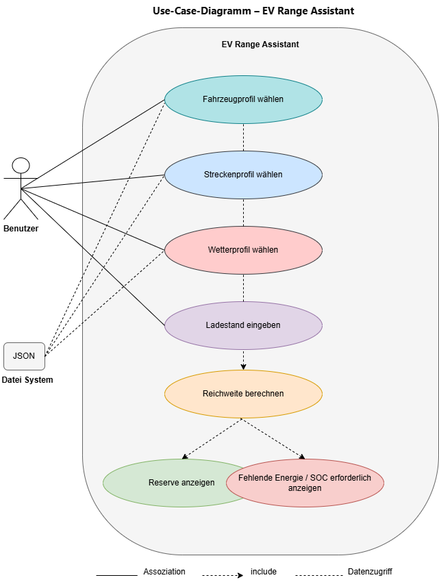

# Semesterbegleitendes Projekt Elektrofahrzeug

## Projektbeschreibung

Die Anwendung berechnet, ob eine geplante Fahrt mit einem Elektrofahrzeug mit dem aktuellen Ladezustand (SoC) möglich ist. Dabei werden Streckensegmente (Stadt, Landstraße, Autobahn), Höhenmeter sowie Wetterbedingungen (Temperatur, Regen, Wind) berücksichtigt.

- Ist die Fahrt **möglich** → Ausgabe der verbleibenden Energiereserve
- Ist die Fahrt **nicht möglich** → Ausgabe der fehlenden Energie und des erforderlichen Mindest-SoC

## Funktionsweise und Anwendung des Programms

Um das Programm zu starten muss die Datei main.cpp zuerst kompilliert und die daraus folgende .exe-Datei  ausgeführt werden. Folgende Befehle sind zu verwenden:

in Git Bash: g++ src/main.cpp src/readJson.cpp src/rechner.cpp -I include -o main.exe
in cmd: .\main.exe

Nach dem Ausführen der .exe wird der Benutzer im Terminal in folgender Reihenfolge nach den Dateinamen gefragt: Wetterdaten, Streckenprofil und Fahrzeugparameter. Im Ordner "data" stehen dafür jeweils drei Profile zur Verfügung, die auch nach Belieben kombiniert werden können. Es sollten jedoch nur die mit 1-3 markierten Dateien verwendet werden, da alle anderen für die Durchführung der Tests gedacht sind und Fehler hervorrufen können. Die Dateinamenerweiterung ".json" muss stets mit angegeben werden.
Die Eingabeaufforderungen laufen in Schleifen, was bedeutet, dass der Benutzer die Möglichkeit hat, sich nach falscher oder ungültiger Eingabe so oft er will zu korrigieren. Die nächste Eingabeaufforderung beginnt erst, wenn die vorherige erfolgreich war. Nach einer erfolgreichen Eingabe werden die in der JSON-Datei gespeicherten Werte im Terminal ausgegeben.
Zuletzt wird der Benutzer noch aufgefordert den aktuellen Ladezustand (in Prozent) seines Fahrzeugs anzugeben, dabei werden nur Werte zwischen 0.0 und 100.0 akzeptiert. Auch die Eingabe läuft in einer Schleife und kann beliebig oft wiederholt werden.
Waren alle Eingaben erfolgreich führt das Programm eine Berechnung durch und gibt dem Benutzer an, ob die Fahrt möglich ist oder nicht. Ist die Fahrt möglich werden zudem die Energiereserve und die mindestens benötigte Akkuladung ausgegeben, ist die Fahrt dagegen nicht möglich wird die fehlende Energie und ebenfalls die mindestens benötigte Akkuladung angezeigt.

Der Benutzer hat zu jedem Zeitpunkt die Möglichkeit durch Eingabe von "end" im Terminal das Programm abzubrechen und zu beenden.

## Tests

### Test zum Auslesen der JSON-Dateien

Um den Test zu starten, geben Sie folgende Befehle ein:

in Git Bash: g++ test/ReadJsonTest.cpp src/readJson.cpp -I include -o ReadJsonTest.exe
in cmd: .\ReadJsonTest.exe

#### Testfälle Auslesen der JSONs

Dieser Test überprüft das Verhalten der drei Funktionen innerhalb von readJson.cpp, welche dazu dienen die Wetterdaten, das Streckenprofil und die Fahrzeugparameter auszulesen. Allerdings werden nur für die ersten beiden Testfälle (Regelfall und Zusatzwerte) alle drei Funktionen geteste. Die anderen Testfälle werden immer abwechselnd an einer der drei Funktionen durchgeführt, da sie sich in ihrer Reaktion im Fehlerfall nicht unterscheiden
Die Testfälle sind in `ReadJsonTest.cpp` mit Catch2 implementiert und decken folgende Szenarien ab:

| Testfall                   | Beschreibung                                                                               |
|----------                  |--------------                                                                              |
| Regelfall                  | Werte sind fehlerfrei, Test wird für alle drei Funktionen ausgeführt                       |
| JSON mit Zusatzwerten      | die JSON-Dateien enthalten zusätzliche Werte, Test wird für alle drei Funktionen ausgeführt|
| nicht-existente Datei      | die übergebene Datei existiert nicht oder liegt in einem anderen Verzeichnis               |
| leere JSON                 | die JSON-Datei ist leer                                                                    |
| ungültige JSON             | der Syntax der JSON-Datei ist ungültig                                                     |
| fehlende Werte             | ein oder mehrere von der Funktion erwartete Werte fehlen                                   |
| falscher Datentyp          | ein oder mehr Werte enhalten einen anderen Datentypen, als die Funktion es erwartet        |

### Rechnertest

Um den Test zu starten, geben Sie folgende Befehle ein:

in Git Bash: g++ test/rechnerTest.cpp src/rechner.cpp -I include -o rechnerTest.exe
in cmd: .\rechnerTest.exe

#### Testfälle Rechnertest

Die Testfälle sind in `rechnerTest.cpp` mit Catch2 implementiert und decken folgende Szenarien ab:

| Testfall                   | Beschreibung                                                |
|----------                  |--------------                                               |
| Normalfall – möglich       | SoC 100 %, Standardstrecke, optimales Wetter: Fahrt möglich |
| Normalfall – nicht möglich | SoC 5 % oder sehr lange Strecke : Fahrt scheitert           |
| Wettereinflüsse            | Regen, Kälte (−10 °C), starker Wind erhöhen den Verbrauch   |
| Randwertanalyse            | SoC 0 %, SoC 100 %, Streckenlänge 0 km, Temperaturgrenzen   |

## Modellannahmen

Die genaue Berechnung des Energiebedarfs basiert auf folgenden Annahmen:

| Einflussfaktor      | Annahme                                                                             |
|---                  |---                                                                                  |
| **Geschwindigkeit** | Höhere Geschwindigkeit (Autobahn) erhöht den Verbrauch gegenüber dem Basisverbrauch |
| **Höhenmeter**      | Bergauf erhöht den Verbrauch, Bergab ermöglicht Rekuperation                        |
| **Temperatur**      | Optimalbereich 20–25 °C (Faktor 1,0); Kälte und Hitze erhöhen den Verbrauch         |
| **Regen**           | Erhöht den Verbrauch durch Rollwiderstand                                           |
| **Wind**            | Erhöht den Verbrauch durch Luftwiderstand                                           |
| **Energiepuffer**   | 10 % der Batteriekapazität werden als Reserve betrachtet                            |

## UML-Diagramme

### Klassendiagramm für das Auslesen der JSONs

### Klassendiagramm für die Rechnung

### Use-Case-Diagramm

## Team

Hochschule Esslingen – Fakultät Mobilität und Technik  
Modul: Software-Technik & Software Engineering (SS 2026)  
Betreuer: Prof. Dr.-Ing. Martin Röhricht  
Team: Mert Güclü und Robin Probst
