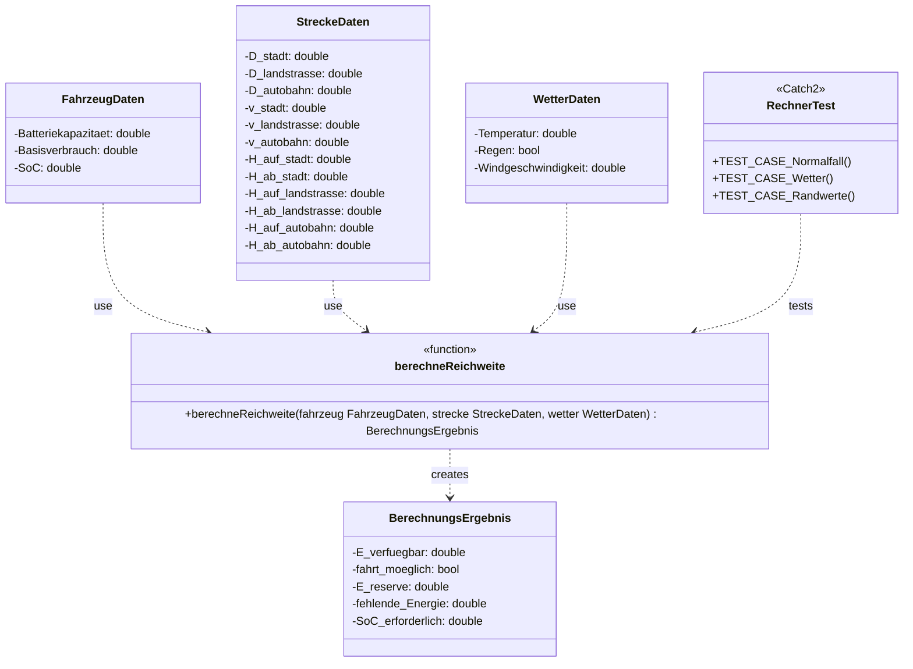

# Semesterbegleitendes Projekt Elektrofahrzeug

## Projektbeschreibung

Die Anwendung berechnet, ob eine geplante Fahrt mit einem Elektrofahrzeug mit dem aktuellen Ladezustand (SoC) möglich ist. Dabei werden Streckensegmente (Stadt, Landstraße, Autobahn), Höhenmeter sowie Wetterbedingungen (Temperatur, Regen, Wind) berücksichtigt.

- Ist die Fahrt **möglich** → Ausgabe der verbleibenden Energiereserve
- Ist die Fahrt **nicht möglich** → Ausgabe der fehlenden Energie und des erforderlichen Mindest-SoC

## Tests

### Rechnertest

Um den Test zu starten, geben Sie folgende Befehle ein:

```bash
g++ -std=c++17 -o tests rechnerTest.cpp rechner.cpp
./tests
```

## Testfälle

Die Testfälle sind in `rechnerTest.cpp` mit Catch2 implementiert und decken folgende Szenarien ab:

| Testfall                   | Beschreibung                                                |
|----------                  |--------------                                               |
| Normalfall – möglich       | SoC 100 %, Standardstrecke, optimales Wetter: Fahrt möglich |
| Normalfall – nicht möglich | SoC 5 % oder sehr lange Strecke : Fahrt scheitert           |
| Wettereinflüsse            | Regen, Kälte (−10 °C), starker Wind erhöhen den Verbrauch   |
| Randwertanalyse            | SoC 0 %, SoC 100 %, Streckenlänge 0 km, Temperaturgrenzen   |

## Modellannahmen

Die genaue Berechnung des Energiebedarfs basiert auf folgenden Annahmen:

| Einflussfaktor      | Annahme                                                                             |
|---                  |---                                                                                  |
| **Geschwindigkeit** | Höhere Geschwindigkeit (Autobahn) erhöht den Verbrauch gegenüber dem Basisverbrauch |
| **Höhenmeter**      | Bergauf erhöht den Verbrauch, Bergab ermöglicht Rekuperation                        |
| **Temperatur**      | Optimalbereich 20–25 °C (Faktor 1,0); Kälte und Hitze erhöhen den Verbrauch         |
| **Regen**           | Erhöht den Verbrauch durch Rollwiderstand                                           |
| **Wind**            | Erhöht den Verbrauch durch Luftwiderstand                                           |
| **Energiepuffer**   | 10 % der Batteriekapazität werden als Reserve betrachtet                            |

## UML-Diagramme

### Klassendiagramm für die Rechnung



### Use-Case-Diagramm


## Team

Hochschule Esslingen – Fakultät Mobilität und Technik  
Modul: Software-Technik & Software Engineering (SS 2026)  
Betreuer: Prof. Dr.-Ing. Martin Röhricht  
Team: Mert Güclü und Robin Probst
