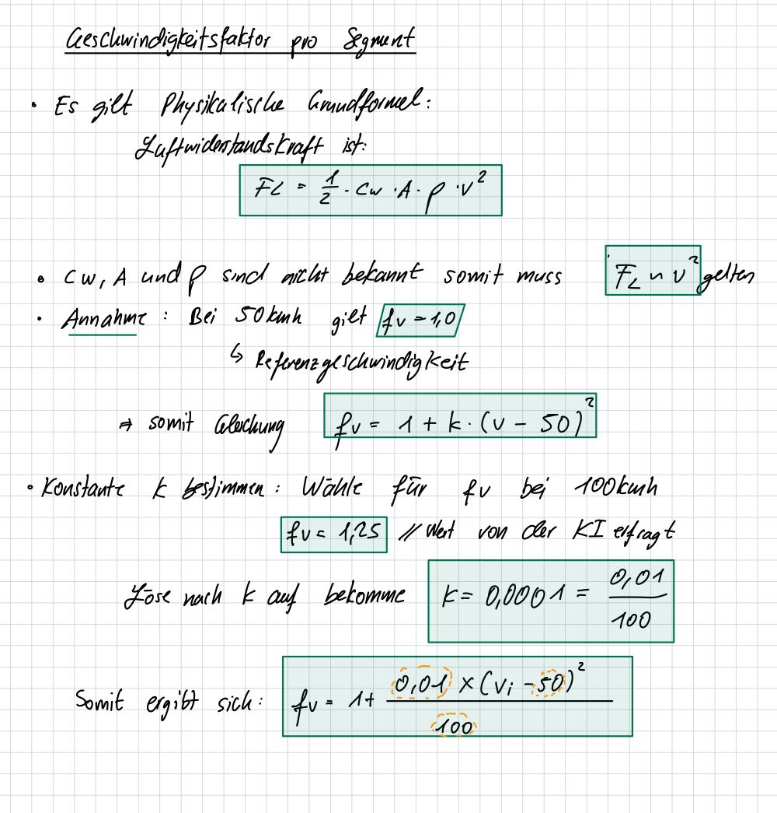

# Berechnungen und Formeln

Dieses Dokument beschreibt  die mathematischen Formeln, die in rechner.cpp verwendet werden.

## 1. Eingabedaten

### 1.1 Fahrzeugparameter (CarData)

| Parameter         | Symbol      | Einheit    | Beschreibung                 |
|-------------------|-------------|------------|------------------------------|
| Batteriekapazität | $E_{bat}$   | kWh        | Gesamte Batteriekapazität    |
| Basisverbrauch    | $V_{basis}$ | kWh/100 km | Durchschnittlicher Verbrauch |

### 1.2 Streckenparameter (RouteData)

Drei feste Segmente: **Stadt**, **Landstraße**, **Autobahn**.

| Parameter                | Symbol    | Einheit | Beschreibung                 |
|--------------------------|-----------|---------|------------------------------|
| Distanz Segment $i$      | $D_i$     | km      | Streckenlänge des Segments   |
| Geschwindigkeit Seg. $i$ | $v_i$     | km/h    | Durchschnittsgeschwindigkeit |
| Höhenmeter bergauf       | $H_{auf}$ | m       | Gesamter Aufstieg            |
| Höhenmeter bergab        | $H_{ab}$  | m       | Gesamter Abstieg             |

### 1.3 Wetterparameter (WeatherData)

| Parameter           | Symbol | Einheit | Beschreibung    |
|---------------------|--------|---------|-----------------|
| Temperatur          | $T$    | °C      | Außentemperatur |
| Regen               | $R$    | bool    | true = Regen    |
| Windgeschwindigkeit | $W$    | km/h    | Gegenwind       |

### 1.4 Ladezustand (eigener Parameter)

| Parameter   | Symbol | Einheit | Beschreibung            |
|-------------|--------|---------|-------------------------|
| Ladezustand | $SoC$  | %       | State of Charge (0–100) |

## 2. Schritt-für-Schritt-Berechnung

### Schritt 1 – Basisenergieverbrauch pro Segment

$$E_{basis,i} = \frac{D_i}{100} \times V_{basis}$$

Angewendet auf alle drei Segmente:

$$E_{basis,Stadt} = \frac{D_{Stadt}}{100} \times V_{basis}, \quad
E_{basis,Land} = \frac{D_{Land}}{100} \times V_{basis}, \quad
E_{basis,AB} = \frac{D_{AB}}{100} \times V_{basis}$$

> **Herrleitung:** Analogie zur Kraftstoffberechnung bei Verbrennern (Liter/100 km). y (Liter) = x (km) * Verbrauch (Liter/100 km).

---

### Schritt 2 – Geschwindigkeitsfaktor pro Segment

$$f_{v,i} = 1 + \frac{0{,}01 \times (v_i - 50)^2}{100}$$

Referenzgeschwindigkeit: 50 km/h → $f_v = 1,0$.

| $v_i$ | $f_{v,i}$ |
|--------|-----------|
| 50 km/h | 1,00 |
| 100 km/h | 1,25 |
| 130 km/h | 1,64 |

> **Herrleitung:** Die KI hat die Formel erstellt, allerdings wurde versucht,es herzuleiten (Rollwiderstand:konstant bei jeder Geschwindigkeit,Luftwiderstandskraft quadratisch und macht das meiste aus,...):  
> 

---

### Schritt 3 – Temperaturfaktor (global)

$$f_{T} = \begin{cases}
1,0 + 0,015 \times (20 - T) & T < 20\,°C \\
1,0                          & 20\,°C \leq T \leq 25\,°C \\
1,0 + 0,01 \times (T - 25) & T > 25\,°C
\end{cases}$$

| $T$ | $f_T$ |
|------|--------|
| −20 °C | 1,60 |
| 0 °C | 1,30 |
| 20–25 °C | 1,00 |
| 35 °C | 1,10 |

> **Quelle:** ADAC: *E-Auto im Winter – Mehr Verbrauch, weniger Reichweite* (2024), https://www.adac.de/rund-ums-fahrzeug/elektromobilitaet/laden/elektroauto-reichweite-winter/  

---

### Schritt 4 – Regenfaktor (global)

$$f_{R} = \begin{cases}
1,05 & R = \text{true} \\
1,0  & R = \text{false}
\end{cases}$$

> **Annahme:** Regen führt zu 5% mehr Verbrauch.

### Schritt 5 – Windfaktor (global)

$$f_{W} = 1 + \frac{0{,}01 \times W^2}{100}$$

| $W$ | $f_W$ |
|------|--------|
| 0 km/h | 1,00 |
| 20 km/h | 1,04 |
| 40 km/h | 1,16 |

> **Herleitung:** Selbe Herleitung wie bei Geschwindigkeitsfaktor, allerdings ohne Referenzgeschwindigkeit. Faktoren  von der KI bestimmt, da keine Quelle gefunden.

---

### Schritt 6 – Höhenfaktor (global)

Basierend auf $E_{pot} = m \cdot g \cdot h$ wird der Höheneinfluss relativ zum Basisverbrauch ausgedrückt:

$$f_H = 1 + \frac{m \cdot g \cdot (H_{auf} - 0,5 \times H_{ab})}{\eta \cdot E_{basis,gesamt} \cdot 3.600.000}$$

mit $E_{basis,gesamt} = \frac{D_{gesamt}}{100} \times V_{basis}$

Falls $D_{gesamt} == 0$, so ist $f_H=1$, andernfalls nutze Formel.  

| Parameter | Wert | Beschreibung |
|-----------|------|--------------|
| $m$ | 2000 kg | Typische Fahrzeugmasse inkl. Fahrer |
| $g$ | 9,81 m/$s^2$ | Erdbeschleunigung |
| $\eta$ | 0,90 | E-Motor Wirkungsgrad |
| $0,5$ | — | Rekuperationseffizienz 50 % |
| $3.600{.}000$ | — | Umrechnungsfaktor J → kWh |

> **Quelle:** ADAC/ÖAMTC: *Rekuperation – Effizienzpotenzial* (2024) — gemessene Rückgewinnung 35–50 %, Mittelwert 50 %,
> https://www.adac.de/rund-ums-fahrzeug/elektromobilitaet/elektroauto/rekuperation-elektroauto/  
> **Herrleitung:** Formel hergeleitet durch KI, allerdings auf Plausabilität mit einfügen von Werten überprüft.

---

### Schritt 7 – Streckentypfaktor pro Segment

$$f_{S,i} = \begin{cases}
1,15 & \text{Stadt} \\
1,00 & \text{Landstraße} \\
0,95 & \text{Autobahn}
\end{cases}$$

> **Annahme:** Vereinfachte Modellannahme. Stadt: häufiges Bremsen und Beschleunigen (+15 %). Landstraße: Referenz. Autobahn: konstantere Geschwindigkeit (−5 %).

---

### Schritt 8 – Gesamtenergieverbrauch

Die Segment-spez. Faktoren werden pro Segment multipliziert.  
Die Wetterfaktoren gelten für die gesamte Fahrt und werden einmalig global aufmultipliziert.

**Zwischensumme (ohne Wetter):**

$$E_{zwischen} = (E_{basis,Stadt} \times f_{v,Stadt} \times f_{H} \times f_{S,Stadt}) + (E_{basis,Land} \times f_{v,Land} \times f_{H} \times f_{S,Land}) + (E_{basis,AB} \times f_{v,AB} \times f_{H} \times f_{S,AB})$$

**Gesamtenergieverbrauch:**

$$E_{gesamt} = E_{zwischen} \times f_T \times f_R \times f_W$$

## 3. Energiebilanz und Ergebnis

### 3.1 Verfügbare, Puffer- und nutzbare Energie

$$E_{verfügbar} = \frac{SoC}{100} \times E_{bat}$$

$$E_{puffer} = 0,1 \times E_{bat}$$

$$E_{nutzbar} = E_{verfügbar} - E_{puffer}$$

> **Annahme:** 10 % der Batteriekapazität verbleiben als Sicherheitsreserve.

### 3.2 Fahrtmachbarkeit

$$\text{fahrtmoeglich} = \begin{cases}
\text{true}  & \text{wenn } E_{gesamt} \leq E_{nutzbar} \\
\text{false} & \text{wenn } E_{gesamt} > E_{nutzbar}
\end{cases}$$

---

### 3.3 Ergebniswerte (BerechnungsErgebnis)

**Falls fahrt_moeglich = true:**

$$E_{reserve} = E_{nutzbar} - E_{gesamt}$$

$$\Delta E = 0, \quad SoC_{erforderlich} = 0 \quad \text{(nicht benötigt)}$$

**Falls fahrt_moeglich = false:**

$$\Delta E = E_{gesamt} - E_{nutzbar}$$

$$SoC_{erforderlich} = \frac{E_{gesamt} + E_{puffer}}{E_{bat}} \times 100$$

$$E_{reserve} = 0 \quad \text{(nicht benötigt)}$$
